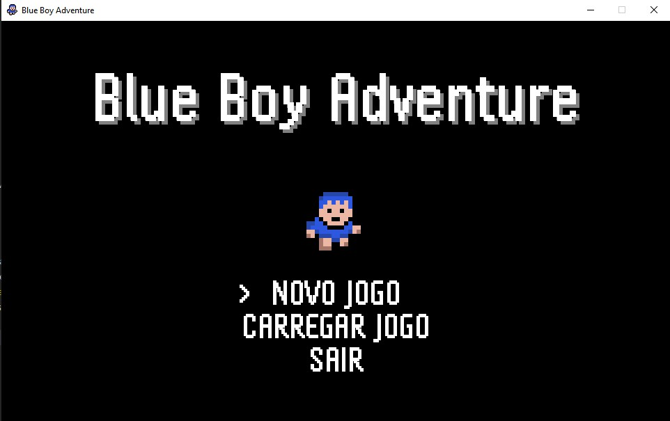

# 🎮 Blue Boy Adventure

**Blue Boy Adventure** é um protótipo de jogo de aventura com elementos de RPG e exploração, desenvolvido como parte de um projeto acadêmico. Este protótipo tem como objetivo validar mecânicas e funcionalidades que servirão de base para o jogo final, denominado *A Última Luz*.

## 🌍 Ambientação

O jogo se passa em um mundo dinâmico, com ciclo dia/noite, combates estratégicos e interação profunda com o ambiente. O jogador pode explorar cenários variados, enfrentar inimigos e interagir com NPCs e objetos diversos.

## 👥 Público-Alvo

Destinado a jogadores a partir de 12 anos, fãs de RPGs e jogos de ação com foco em exploração e progressão. O protótipo foi desenvolvido para a plataforma **PC**.

## 🧩 Mecânicas Implementadas

- Game loop funcional
- Controle via teclado
- Sprites e animações
- Sistema de tiles e câmera
- Interações com objetos, NPCs e diálogos
- Inventário com itens equipáveis e projetáveis
- Sistema de combate com vida, mana, atributos e chefões
- Eventos ambientais: buracos, cura, teleporte
- Iluminação dinâmica e ciclo dia/noite
- Minimapa e interface com telas de menu, seleção de classe e game over
- Algoritmo de busca de caminhos (A*)
- Sistema de comércio e saque de baús
- Cutscenes, quebra-cabeças e efeitos sonoros

## 🛠️ Tecnologias e Referências

O desenvolvimento contou com o apoio de videoaulas do canal [RyiSnow](https://www.youtube.com/@RyiSnow), cujos códigos e tutoriais foram fundamentais para a implementação das mecânicas principais.

## 🧰 Requisitos para Executar no Visual Studio Code
Para rodar o projeto Java no VS Code, é necessário instalar as seguintes extensões:
- Java Extension Pack – pacote que inclui:
  - Language Support for Java™ by Red Hat
  - Debugger for Java
  - Java Test Runner
  - Maven for Java
  - Visual Studio IntelliCode

## ⚙️ Configuração do Ambiente
- Instale o Java JDK (versão 21).
- Instale o Visual Studio Code.
- Abra o VS Code e instale o Java Extension Pack pela aba de extensões.
- Clone o repositório:

## 📥 Como Executar
- Clone o repositório:
git clone https://github.com/Rafaela-Ferreira/PrototipoBlueBoyAdventure.git
- Abra o projeto no ambiente de desenvolvimento
- Execute a cena principal.

## 🖼️ Imagem do Protótipo

## 🧑‍💻 Autora
Rafaela Ferreira – Desenvolvedora e pesquisadora do projeto.

